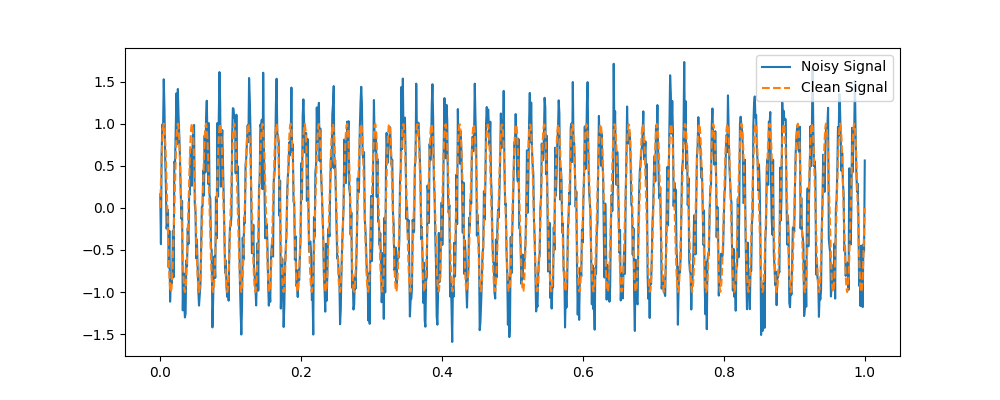
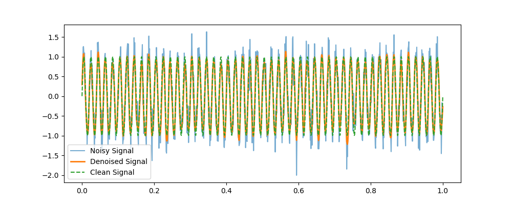

# AI-Driven Signal Denoising for 5G Networks

## 📌 Project Overview

This project implements a **1D Convolutional Neural Network (CNN)** to denoise **noisy 5G signals**. The goal is to improve signal clarity by reducing Gaussian noise using deep learning techniques.

## 🚀 Features

- **Synthetic Signal Generation**: Generates noisy sine waves to simulate 5G interference.
- **Deep Learning Model**: Uses a CNN-based architecture to remove noise.
- **Training & Testing Pipeline**: Model trains on synthetic data and evaluates performance.
- **Visualization**: Compare noisy vs. denoised signals with Matplotlib.

## 📂 Project Structure

```
signal-denoising/
│── dataset.py          # Generate noisy signal dataset
│── model.py            # Define CNN-based denoising model
│── train.py            # Train the model
│── test.py             # Test & visualize results
│── requirements.txt    # Dependencies
│── README.md           # Project documentation
```

## 📊 Dataset Example

### **Noisy Signal vs. Clean Signal**



### **Denoised Signal (Model Output)**


## 🔧 Setup & Installation

1️⃣ Clone the repository:

```bash
git clone https://github.com/QuangMinh-Le/signal-denoising-5g.git
cd signal-denoising-5G
```

2️⃣ Create and activate a virtual environment:

```bash
python -m venv venv
source venv/bin/activate  # On macOS/Linux
venv\Scripts\activate    # On Windows
```

3️⃣ Install dependencies:

```bash
pip install -r requirements.txt
```

4️⃣ Run dataset generation:

```bash
python dataset.py
```

5️⃣ Train the model:

```bash
python train.py
```

6️⃣ Test & visualize results:

```bash
python test.py
```

## 🎯 Future Improvements

- Train on real-world 5G datasets
- Use RNNs or GANs for better denoising
- Optimize inference speed for real-time applications

## 📜 License

This project is open-source under the **MIT License**.

🚀 **Feel free to contribute and improve!**

